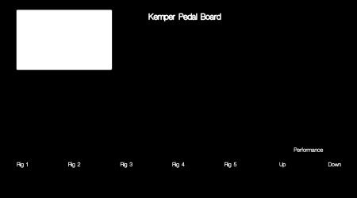

# kemperPedalBoard
Control hardware for a Kemper Profiling Amp looking like a "real" pedalboard, consisting of a central control unit, communicating to the amp, and some small stompboxes, connected to the control unit.

The central control unit will be based on a Raspberry Pi Zero W, connected to the Amp via MIDI. It should have 5 Footswitches for the Rigs in the current performance (a bit like my [smallKemperRemote](https://github.com/JanosGit/smallKemperRemote/)), RGB OLED Displays above all 5 Switches, displaying the rig name and changing it's colour from green to red according to the rig gain. A central Display informs about the current performance and other useful information. The central control unit will communicate to other hardware via OSC. Therefore an integrated Ethernet switch will be used to connect it to additional "stompboxes" controlling special functions like delay, distortion, etc... Furthermore, a connection to a smartphone app could be established through the onboard Wifi Module.
The Software for the central control unit will be based on my favourite C++ framework JUCE.
The Hardware for the central control unit will be based on a custom aluminium front panel, designed by the [Schaeffer Front Panel Designer](www.schaeffer-ag.de/en/downloads/front_panel_designer/?no_cache=1)

                                                                                                            
The stompboxes will most probably be built around my favourite microcontroller, the TI TM4C, powered by the TI TivaWare C framework and will all share the same hardware and core-software.
